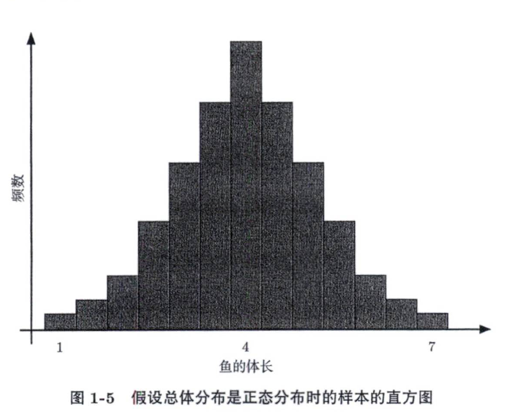
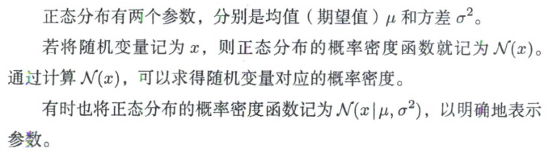
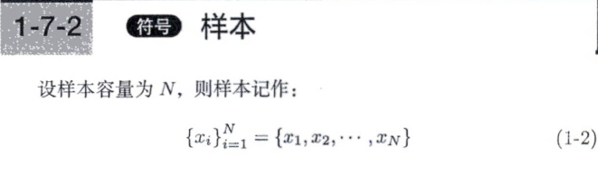
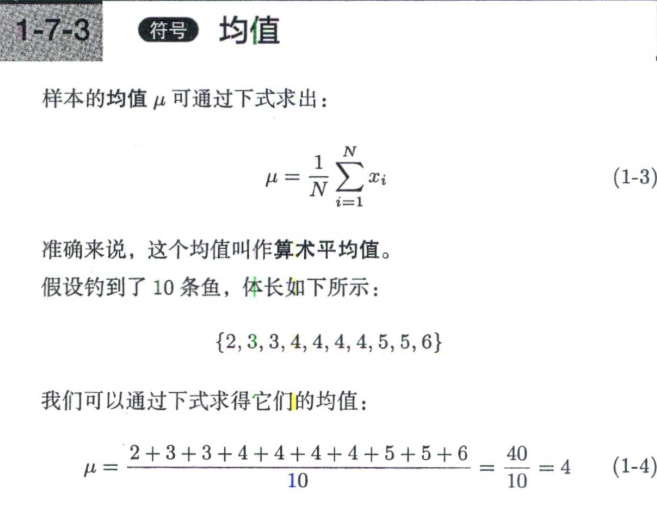
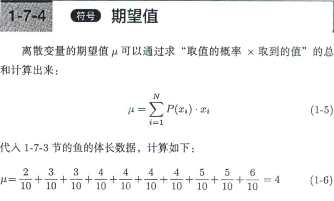
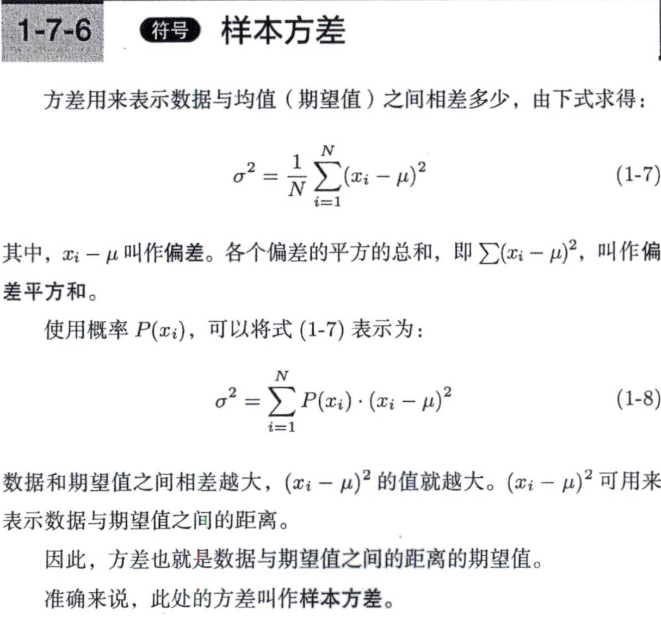
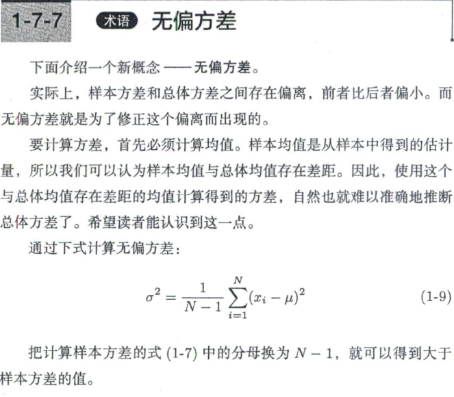

# 1. 统计学基础
**统计学的目标**：描述现有数据、估计未知数据

## 1-2 获取样本的过程

**样本**是指现有数据。
**总体**是指既包含现有数据也包含未知数据的全部数据。
只使用样本这一部分数据来讨论总体这一全部数据就是**统计推断的目标**。

从总体中获取样本叫作**抽样**。
由随机变量得来的具体数值叫作**样本值**。

随机选择总体中各个元素的方法叫作**简单随机抽样**。
样本的大小或现有数据的个数叫作**样本容量**。

## 1-3 抽样过程的抽象描述

当某数据和某种概率分布相符时，就叫作**服从概率分布**。
总体服从的概率分布叫作**总体分布**。

A：从湖中钓到了3cm长的鱼。
B：从总体中抽样，获取了3cm长的鱼这个样本。
C:作为服从总体分布的随机变量，获取了3cm长的鱼这个样本。

## 1-4 描述统计基础 

能够定量表示的数据叫作**定量变量**，也叫**数值变量**。
定量变量又分为两种。1条、2条这种只取整数的数据叫作离散变量。2.3cm、4.25cm这种会取到小数点之后的值且变化连续的数据叫作连续变量。

不能定量表示的数据叫作**分类变量**，例如种类名称。

在定量变量中，我们经常会看到数值被分成几个范围，这些范围就叫作**组**。代表组的值叫作**组中值**。

**频数**就是某个数据出现的次数。如果只钓到了1条3cm长的鱼，就说3cm长的鱼的频数是1。
**频数分布**是每个组中数据的频数的排列。
频数占总数的比例叫作**频率**。

把组按从小到大的顺序排列，将频数相加，得到的和叫作**累积频数**。
按同样方法得到的频率的和叫作**累积频率**。

表示频数分布的图叫作**直方图**。

**期望值**经常被当作预测值使用，这是期望值也能用作未知数据均值的方便之处。根据期望值的定义，在样本中，**均值**和**期望值**完全相同。

**方差**用来表示数据与均值（期望值）之间相差多少。

## 1-5 总体分布的推断

在统计学中也会为总体分布做假设。具体来说，人们一般会选择通过计算就能简单地得到概率的常见的分布。不过，我们不能只考虑计算是否容易，所选择的分布也应该符合实际数据。

正态分布就是其中一种，既容易计算又符合数据。

服从正态分布的随机变量的直方图的特征在于，以均值为轴左右对称。

## 1-6 概率质量函数与概率密度函数

在将数据作为参数时，所得函数值是概率的函数叫作**概率质量函数**。

离散变量可以直接计算概率，而连续变量不能直接计算概率。

我们无法求得鱼体长是4cm的概率，但如果求体长不小于4cm且不大于5cm的概率，就可以通过计算概率密度在4cm和5cm之间的积分得到的概率是0。

可以认为积分是加法的扩展，**取概率密度在4到5的区间上的积分，基本等同于求4到5的区间上无数个概率密度的总和**。

正态分布符号及数学表达式：

如果假设总体分布是正态分布，有的数据则会严重偏离实际。正态分布确实计算方便，但也不能死板套用。

因此，人们有时也会使用其他概率分布，常用的有二项分布和泊松分布等。二项分布适用于硬币的正反面这种结果只有两种形式的数据。泊松分布多用于个数、次数等只取大于0的整数的数据。

**推断总体分布=确定分布的种类+估计分布的参数**

但是样本的统计量和参数之间普遍存在差别，我们必须认识到估计出来的参数存在**估计误差**。

## 1-7 统计量的计算

总体的均值叫作**总体均值**。样本的均值叫作**样本均值**。

实际上，样本方差和总体方差之间存在偏离，前者比后者偏小。而无偏方差就是为了修正这个偏离而出现的。

标准差通过对方差取平方根而得出。这里的方差一般使用无偏方差。