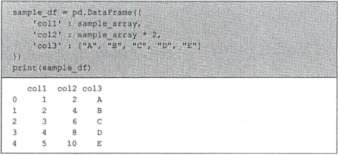
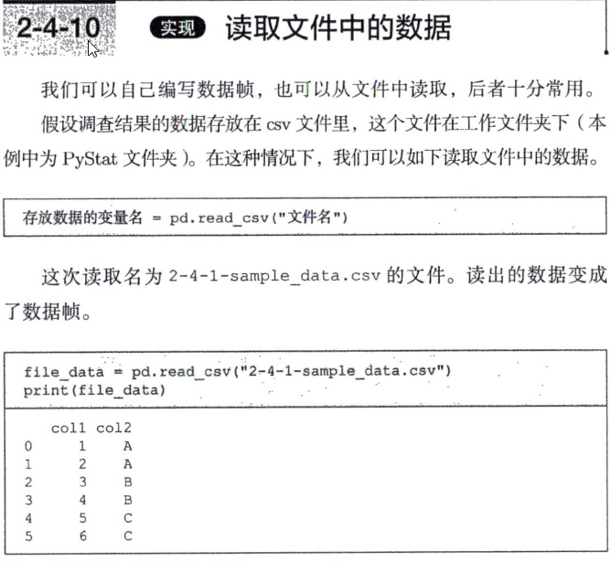
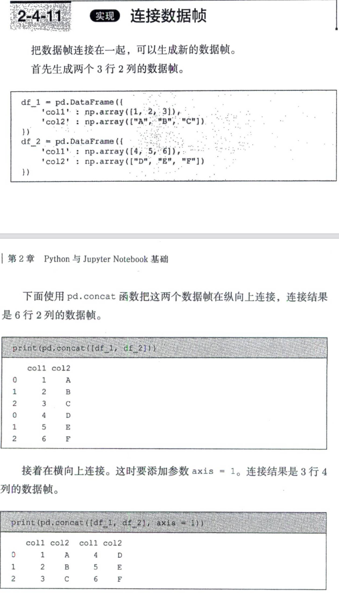

# 第二章 python基础

感觉可以跳过。

主要介绍一下numpy和pandas两个库，numpy主要用array存放矩阵数据，pandas主要为了使用DataFrame对数据进行管理。

## numpy库(简称np)

### 使用列表生成数组

```python
sample_array = np.array([1,2,3,4,5])
array([1,2,3,4,5])
```

对数组进行的运算会作用在数组的所有元素上,例如**加法运算**和**乘法运算**。

一个数组只能存放相同类型的数据。如果同时存放数值型和字符串型的数据，则所有数据都会被当成字符串处理。

获取行数和列数的方法如下：

```python
sample_array.shape
(2, 5)
```

生成等差数列的方法:

```python
np.array(start=1, stop=6, step=1)
array([1,2,3,4,5])
```

### 其他多种生成数组的方式

要生成元素相同的数组，可以使用函数np.tile。

```python
np.tile("A",5)
array(['A','A','A','A','A'])
```

在生成只有0的数组时，使用函数np.zeros会更简便。该函数也可以生成二维数组，将元素个数按t行数，列数］的顺序传入即可。

```python
np.zeros(4)
array([0.,0.,0.,0.])
```

使用函数np.ones可以生成只有1的数组。这个函数的参数也可以是列表。

```python
np.ones(3)
array([1.,1.,1.])
```

### 切片取出array中数据

使用切片（slice）,可以从数组或列表中轻松地取出数据。在取出数据时使用方括号，例如sample_array[0]。要取出一定范围的数据，就要使用冒号。例如：

```python
d2_array[0,3] => 第1行第4列 => 4
d2_array[1,2:4] => array([8,9])
```

## pandas库(简称pd)

### 数据帧

数据帧有多种生成方法，我们可以轻松地通过数组或列表生成。注意在写代码时不要忘了方括号。



在定义数据帧时，列名和列中的数据按照'coll':sample_array这样的格式指定。与数组不同，在数据帧中，不同的列保存的数据类型可以不同。

另外，上例在打印数据帧的内容时使用了print函数，但也可以不使用该函数0如果不写print(sample_df)而写成sample_df,输出结果的外观会变化。不过，具体采用哪种风格完全取决于读者。本书中也没有特别进行区分，两种方式都在用。

不使用print函数时的输出结果，可以看出外观有一定的变化。

### 读取文件数据

```python
pd.read_csv("文件名")
```



### 连接数据帧

```python
pd.concat([df_1, df_2])         # 纵向连接
pd.concat([df_1, df_2], axis=1) # 横向连接
```



### 数据帧的列操作

```python
print(sample_df.col2)         # 使用点操作符按列名提取数据
print(sample_df["col2"])         # 使用方括号
print(sample_df["col2", "col3"])   # 可以提取多个列
print(sample_df.drop("col2", axis=1))    # 删除指定的列
```

### 数据帧的行操作

```python
print(sample_df.head(n=3))              # 提取最上面3行
print(sample_df.query('index == 0'))    # 使用query灵活提取第一行
print(sample_df.query('col3 == "A"'))   # 使用query按条件提取
print(sample_df.query('col3 == "A"' | 'col3 == "D"'))      # 使用query按条件OR提取
print(sample_df.query('col3 == "A"' | 'col1 == 3'))        # 使用query按条件AND提取
print(sample_df.query('col3 == "A"')[["col2","col3"]])     # 同时指定行和列的条件
```