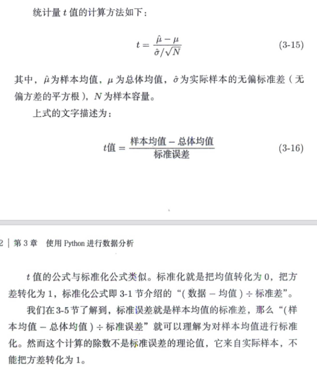

# 第三章 使用python进行数据分析

## 使用Python进行描述统计：单变量

### 统计分析与scipy

scipy中包含用于“计算统计量等基础的数据分析工作”的函数。

执行下面的语句，即可将打印精度设置为3位。

```python
%precision 3
```

### 单变量数据的操作

单变量数据是指只有一种类型的数据，例如鱼的体长。

```python
fish_data = np.ones(10)
```

### 总和与样本容量

```python
import scipy as sp

sp.sum(fish_data) => 10         # 总和
len(fish_data) => 10            # 样本容量
```

### 均值(期望值)

```python
N = len(fish_data)
S = sp.sum(fish_data)
avg = S / N

# 等价替换
sp.mean(fish_data)
```

### 样本方差

```python
sigma_2_sample = sp.sun((fish_data-mu)** 2) / N

# 等价替换
sp.var(fish_data, ddof = 0)
```

### 无偏方差

```python
sigma_2_sample = sp.sun((fish_data-mu)** 2) / (N-1)

# 等价替换
sp.var(fish_data, ddof = 1)
```

### 标准差

```python
sigma_2 = sp.sqrt(sigma_2_sample)

# 等价替换
sp.std(fish_data, ddof = 1)
```

### 标准化

标准化就是把均值转化为0，把标准差(方差)转化为1。

要使均值为0，只需用所有样本减去均值即可。

同样，要使数据的标准差(方差)为1，只需用所有样本除以标准差即可。


### 其他统计量

```python
sp.amax()    # 求最大值
sp.amin()    # 求最小值
sp.median()     # 求中位数
```

## 基于matplotlbi和seaborn的数据可视化

```python
plt.plot(x,y,color='')    # 折线图
sns.set()    # 图片背景会有变化

# bins=各组频数，5表示分割成5组，kde=False表示禁用核密度估计。
# 通过核密度估计将直方图平滑化，不使用kde
sns.displot(data,bins=5,color='',kde=False)     # 直方图

sns.boxplot(xlabel,ylabel,data,color)   # 箱型图
sns.violinplot(xlabel,ylabel,data,color)    # 小提琴图
sns.barplot(xlabel,ylabel,data,color)    # 条形图

sns.joinplot(xlabel,ylabel,data,color)   # 同时绘制散点图和直方图

sns.pairplot(xxx...)     # 散点矩阵图
```

## 用python模拟抽样

```python
# 从样本中进行抽样,size是容量，replace=false代表是不放回抽样
np.random.choice(data,size = 5, replace=False)

# 使用函数stats.norm.pdf计算概率密度,loc为均值，scale为标准差
stats.norm.pdf(x = x, loc = 4, scale = 0.8)

# 用stats.norm.rvs函数直接生成服从正态分布的随机数
stats.norm.rvs(loc = 4, scale = 0.8， size = 10)
```

## 样本统计量的性质

### 样本分布

**样本分布**是样本的统计量所服从的概率分布。

### 多次计算样本均值

```python
# 生成正态分布
population = stats.norm(loc = 4, scale = 0.8， size = 10)
# 生成一个样本容量为10000的矩阵数组
sample_mean_array = np.zeros(10000)

# 遍历10000次
for i in range(0,10000):
    sample = population.rvs(size=10)
    sample_mean_array[i] = sp.mean(sample)
```

### 样本均值与总体均值相近

### 定义用来计算样本均值的函数

```python
def cal_sample_mean(size,n_trial):
    sample_mean_array = np.zeros(size)
    for i in range(0,n_trial):
        sample = population.rvs(size=size)
        sample_mean_array[0] = sp.mean(sample)
    return sample_mean_array
```

### 不同样本容量所得的样本均值的分布


样本容量越大，样本均值越集中在总体均值的附近。

### 样本均值的标准差小于总体标准差


样本容量越大，样本均值的标椎差就越小。增加样本容量就能得到更集中更可信的样本均值.

### 标准误差的直观解释

**样本均值的标准差必然小于总体的标准差**

如果把空间放大到能坐100人的飞机，很难想象这100个座位上全是特别高大的人。

乘坐人数越多，出现身材小巧的乘客的概率就越大，乘客的体重均值就越不容易极端。

### 采用无偏方差消除偏离

### 样本容量越大，其无偏方差越接近总体方差

### 无偏性

估计量的期望值相当于真正的参数的特性叫作无偏性。

说估计量具有无偏性，就是说它没有偏离，它的均值不会过大也不会过小。

### 一致性

样本容量越大，估计量越接近真正的参数的特性称为一致性。

估计值具有一致性，就是说当样本容量趋向于无穷大时，估计量趋近于参数。

### 大数定律

所谓大数定律，就是样本容量越大，样本均值越接近总体均值。

大数定律分为弱大数定律和强大数定律,具体参考文献。

### 中心极限定理

对于任意总体分布，样本容量越大，随机变量的和的分布越接近正态分布，这就是中心极限定理。

## 3-6 正太分布及其应用

### 3-6-1 导入函数库

### 3-6-2 概率密度


使用scipy.stats中的函数可以快捷地完成上述计算步骤。例如之前介绍过的stats.norm.pdf函数

```python
stats.norm.pdf(loc=4,scale=0.8,x=3)
```

### 3-6-3 样本小于等于某值的比例


### 3-6-4 累积分布函数术语


### 3-6-5 累积分布函数实现

使用scipy.stat的stats.norm.cdf方法


### 3-6-6 左侧概率与百分位数


### 3-6-7 百分位数实现

使用scipy.stat的stats.norm.ppf(percent point function)方法


### 3-6-8 标准正态分布


### 3-6-9 t值



### 3-6-10 t值的样本分布


### 3-6-11 t分布术语

当总体服从正态分布时，t值的样本分布就是t分布。

### 3-6-12 t分布实现


## 3-7 参数估计


