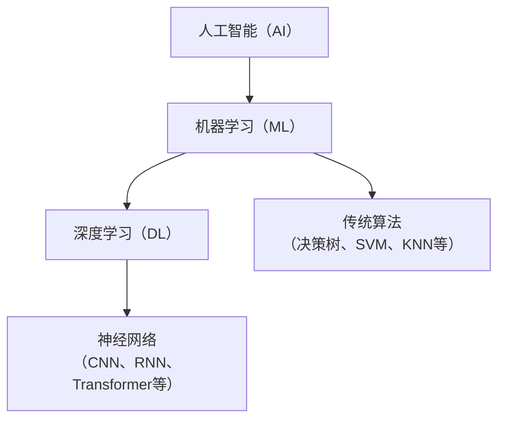

# Practical Statistics With Python

一本文科生也能学懂统计学的python书。两年前我曾经读过此书并且它引导我入门机器学习，
当时我并没有把握把机器学习学到登峰造极的程度达到找到大厂工作的标准，或是我并没有上研究生的心理准备。
到现在工作后，我想起以前那些读过并认为是经典书籍，我不能让自己读过像没有读过一样，让脑中这些书籍蒙尘，
为此，我希望花上一天的时间回顾。

共7个目录章节：
1. 统计学基础
2. Python 与 Jupyter Notebook基础
3. 使用Python进行数理统计
4. 统计模型基础
5. 正态线性模型
6. 广义线性模型
7. 统计学与机器学习

顺便回顾下，机器学习、深度学习与大模型之间的区别和联系，
我们可以从定义、关系和对比三个方面来讲清楚它们：

## ✅ 一、定义对比

| 项目           | 机器学习（Machine Learning）                       | 深度学习（Deep Learning）                                |
|----------------|--------------------------------------------------|-----------------------------------------------------------|
| 所属关系       | 人工智能的一个分支                                  | 机器学习的一个子分支                                      |
| 核心思想       | 让机器从数据中学习规律并进行预测或分类                | 模仿人脑神经网络结构的进行多层特征学习                   |
| 特征提取方式   | 需要人工设计特征（Feature Engineering）              | 自动从数据中学习特征，不需要手工提取                     |
| 模型复杂度     | 模型相对简单，如决策树、SVM、KNN                     | 模型复杂，通常包含多层神经网络（如 CNN、RNN、Transformer）|
| 计算资源要求   | 通常较低，可在普通电脑上训练                          | 要求高，常需要 GPU、TPU 等加速计算设备                  |
| 示例算法       | 决策树、线性回归、SVM、K近邻等                       | 卷积神经网络（CNN）、循环神经网络（RNN）、Transformer 等 |

**机器学习（Machine Learning，ML）** 是一种人工智能方法，
通过让计算机从数据中学习规律，从而做出预测或决策。它包括监督学习、无监督学习、强化学习等各种算法，例如：
+ 决策树
+ 支持向量机（SVM）
+ 随机森林
+ 神经网络（深度学习）

**深度学习** 是机器学习的一种方式，区别在于它能自动从大量数据中学习复杂特征，不再依赖手工设计。

**大模型（Large Model / Foundation Model）** 是一类参数规模非常庞大、基于深度学习的模型。
通常指的就是大规模预训练模型，比如：
+ GPT（OpenAI）
+ BERT（Google）
+ LLaMA（Meta）

它们通常使用数十亿甚至数千亿参数，训练于海量数据上，可以支持多种任务（NLP、图像、代码等）。

> [!NOTE]
> 深度学习是机器学习的一个子分支，大模型（如GPT）属于机器学习中的一种（深度学习子集）。

## ✅ 二、联系
大模型是机器学习的一种产物，属于深度学习（机器学习的子领域）的一种。

大模型用的基础技术是神经网络，尤其是Transformer结构。

大模型训练时使用的优化算法、损失函数、本质上都是机器学习中的方法。

## ✅ 三、区别对比（简化理解）

| 项目           | 机器学习（Machine Learning）       | 深度学习（Deep Learning）                           |
|----------------|-----------------------------------|----------------------------------------------------|
| 范围            | 更广，包含各种算法                 | 属于机器学习中的一种（深度学习子集）                  |
| 参数规模        | 从几百到几百万不等                  | 参数量极大，几十亿甚至上千亿                         |
| 数据需求        | 相对较少                           | 极度依赖大规模语料、图像或多模态数据                  |
| 应用能力        | 通常用于特定任务                    | 可以通用于多个任务（如聊天、翻译、代码）              |
| 示例            | 决策树、SVM、KNN、CNN等            | GPT-4、BERT、LLaMA、Claude等                       |

> [!IMPORTANT]
> 1. 深度学习是机器学习的一种方式，区别在于它能自动从大量数据中学习复杂特征，不再依赖手工设计。
> 2. 大模型是建立在机器学习之上的深度学习模型，是机器学习发展的一个高级阶段和应用体现。