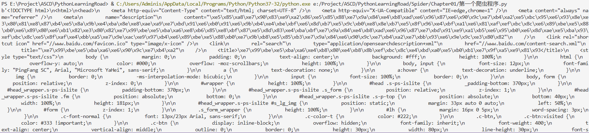
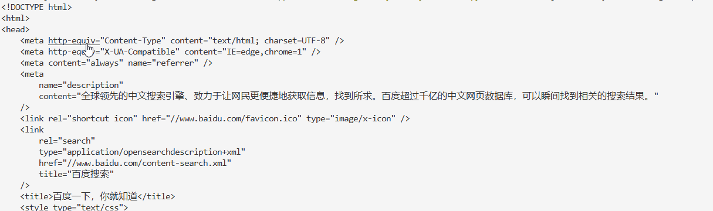

# Chapter01

哈！

## 1.1 爬虫概述

图片、数据、视频、歌曲等等，你想要的都可。万事皆虚，万物皆允。

语言只是工具，抓取数据是目的，只不过使用python抓取更加容易。

君子协议robots.txt文件，用来告诉搜索引擎爬虫哪些内容允许抓取、哪些不允许。

## 1.2 手刃小爬虫

使用urlopen爬取百度的内容，得到response.read结果为：



如果你想以正常字符串形式打印内容，可以加上 .decode()查看：



可以将结果写入文件：

```python
with open("result.html", "w", encoding="utf-8") as f:
    f.write(response.read().decode())
```

## 1.3 web请求过程解析

浏览器输入网址 → DNS 解析 → 建立连接（TCP/SSL）→ 发 HTTP 请求 → 服务器响应 → 浏览器渲染页面

1. 服务端渲染：在服务器那边直接把数据和html整合在一起，统一返回给浏览器

    在页面源代码中能看到数据

2. 客户端渲染：

    第一次请求只要一个html骨架，第二次请求拿到数据，进行数据展示。

    在页面源代码看不到数据。

    要熟练使用抓包工具。

## 1.4 HTTPS协议

主要分为4个阶段：发送请求、验证身份、协商密钥、加密通信。

1. 客户端想服务器发起网络请求

2. 服务端收到客户端请求，将服务器使用的公钥发送给客户端验证，客户端通过本地预置的一些信任证书文件与服务器传输的公钥进行对比，如果验证失败就会提示公钥不被信任。

3. 协商密钥：如果客户端校验成功则会将客户端使用的证书公钥使用服务器传输的公钥进行加密后传输给服务端。服务端收到加密的客户端公钥后，会使用自己的是要解密数据获取客户端的公钥，并生成一个确定不会被第三方窃听到的session key，并使用客户端的公钥进行加密后传输给客户端作为一段会话的标志。

4. 加密通信: 客户端与服务器之间的通信将全程使用协商的session key对通信的数据进行加密。

## 1.5 request入门

```python
query = input("请输入一个你喜欢的明星")
url = 'https://www.sogou.com/web?query=周杰伦'
headers = {
    "User-Agent":"Mozilla/5.0 (Windows NT 10.0; Win64; x64) AppleWebKit/537.36 (KHTML, like Gecko) Chrome/137.0.0.0 Safari/537.36"
}

resp = requests.get(url,headers=headers)

print(resp)
print(resp.text)
```