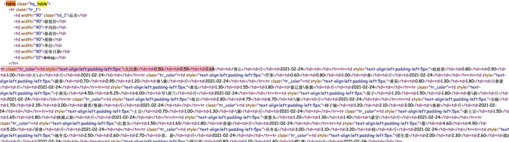

# Chapter02 数据解析与提取

## 2.1 re

[OSChina正则工具](https://tool.oschina.net/regex)

常用元字符：

| 元字符  | 含义 |
| ------------- | ------------- |
| .            | 匹配除换行符外的任意字符  |
| \w            | 匹配字母或数字或下划线  |
| \s            | 匹配任意空白符  |
| \d            | 匹配数字  |
| \n            | 匹配换行符  |
| \t            | 匹配制表符  |
|               |   |
| ^             | 匹配字符串的开始（爬虫用的不多，主要是校验）  |
| $             | 匹配字符串的结束（爬虫用的不多，主要是校验）  |
|               |   |
| \W            | 匹配非字母或数字或下划线  |
| \S            | 匹配非空白符  |
| \D            | 匹配非数字  |
| a竖线b         | 匹配字符a或字符b  |
| ()            | 匹配括号的表达式，也表示一个组  |
| [...]            | 匹配字符组中的字符  |
| [^...]            | 匹配除了字符组中的所有字符  |


| 量词  | 含义 |
| ------------- | ------------- |
| *            | 重复零次或多次  |
| +            | 重复一次或多次  |
| ?            | 重复零次或一次  |
| {n}           | 重复n次  |
| {n，}           | 重复n次或更多次  |

贪婪匹配和惰性匹配
| 量词  | 含义 |
| ------------- | ------------- |
| .*            | 贪婪匹配  |
| .*?            | 惰性匹配  |


## 2.2 python中re模块的使用

包括re模块的findAll、finditer、match、search等方法

并推荐使用re.complie进行预加载正则表达式

爬取豆瓣电影排行榜是用正则过滤静态网页源代码的数据，用了很多惰性匹配表达式，顺便介绍使用csv存储文件。

## 2.3 bs4(beautiful soup语法解析)

需要了解一点点html知识

为什么叫超文本标记语言？超文本即图像等图像也能通过文本方式表现，标记即文本被标签包围起来，标签中可以带有各种属性值。

bs4通过标签名称来拿到数据

```python
# 解析数据
# 1.把页面源代码交给BeautifulSoup进行处理，生成bs对象
page = BeautifulSoup(resp.text, "html.parser") #指定html解析器
# 2.从bs对象中查找数据
# find(标签，属性=值)，返回的感觉是列表
# find_all(标签，属性=值)
# table = page.find("table", class_="hq_table") #class是python关键字，所以这里用class_
table = page.find("table", attr ={"class":"hq_table"}) # 等同上一行，可以避免class
print(table)
trs = table.find("tr")[1:] #因为第一行是表头

# 文件
f = open("菜价.csv",mode="w")
csvwritter = csv.writer(f)

for tr in trs: #每一行
    tds = tr.find_all("td") #每一行的所有td
    name = tds[0].text # .text代表拿到被标签标记的内容
    lowprice = tds[1].text # .text代表拿到被标签标记的内容
    average = tds[2].text # .text代表拿到被标签标记的内容
    high = tds[3].text # .text代表拿到被标签标记的内容
    guige = tds[4].text # .text代表拿到被标签标记的内容
    kind = tds[5].text # .text代表拿到被标签标记的内容
    date = tds[6].text # .text代表拿到被标签标记的内容
    print(name,lowprice,average,high,guige,kind,date)
    # 打开文件写入
    csvwritter.writerow([name,lowprice,average,high,guige,kind,date])

f.close()
```

